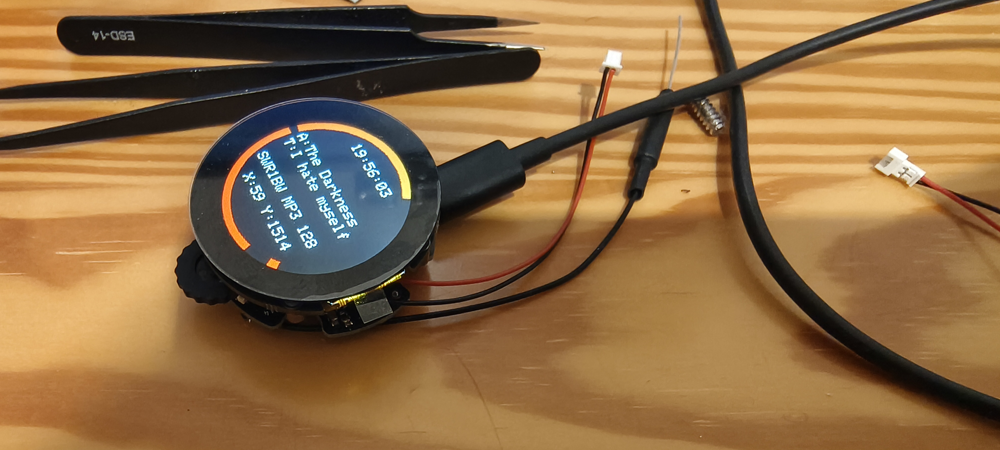

# SensePuck: The Addon Board for the Seeed Round Display

 

 

 

 
 

## Features:

1. **AudioAmplifier MAX98357**: Listen to your favourite Tunes with an Audio Amplifier

2. **I2C Connector for Sensor**: Connect your favourite I2C Sensor board with the embedded 2.54mm connector

3. **Wireless Control**: Untehther your development process with the wireless capabilities. With WiFi, Lora and BLE, this tool allows remote control and data logging. Users can adjust settings and monitor data from a distance, offering a more flexible development experience.

4. **LIS3M Magentometer**: Check your Heading

5. **LSM6 Gyro+ACC**: Check Movements, Steps Pedometer

5. **Open Source & Programmable**: As an open-source device, the Device offers unmatched versatility. It is fully programmable, allowing you to tailor its functionality to your specific applications. This customization extends to software and hardware, opening up endless possibilities for creative and efficient project development.

6. **Compact Design**: Designed for convenience, the LoRaCam Board compact and sleek form factor allows for seamless integration into existing setups. Its compatibility with USB PD power sources and inline integration capability minimizes the need for additional equipment or extensive redesign, making it a versatile and user-friendly addition to any development environment.

7. **Display+Touchscreeen**: Monitor live the current status on the Seeed Display

8. **RTC**: RealTimeClock from the Seeed Display

 

9. **RGB LED**: Status LED

10. **Battery Charger** Use the Battery Charger on the Seeed Display

11. **Rotary Encoder** Perfect for switching the Radio Station
    
## Specifications

 

 

 

Needed Libaries:

https://github.com/schreibfaul1/ESP32-audioI2S
https://github.com/pololu/lis3mdl-arduino
https://github.com/pololu/lsm6-arduino
https://github.com/Seeed-Projects/SeeedStudio_TFT_eSPI
https://github.com/Seeed-Projects/SeeedStudio_lvgl
https://github.com/Seeed-Studio/Seeed_Arduino_RoundDisplay

### Key Features:

### Future Developments:

AI Detection of objects and determine if the device shall sent the data via LoRa 

## Testing for Performance

At the heart of SenseLoRaCam's design is a commitment to reliability and performance. To ensure that SenseLoRaCam stands up to real-world demands, we subjected it to testing under use conditions.

## License

MIT License

Copyright (c) 2025 blue2monster

Permission is hereby granted, free of charge, to any person obtaining a copy
of this software and associated documentation files (the "Software"), to deal
in the Software without restriction, including without limitation the rights
to use, copy, modify, merge, publish, distribute, sublicense, and/or sell
copies of the Software, and to permit persons to whom the Software is
furnished to do so, subject to the following conditions:

The above copyright notice and this permission notice shall be included in all
copies or substantial portions of the Software.

THE SOFTWARE IS PROVIDED "AS IS", WITHOUT WARRANTY OF ANY KIND, EXPRESS OR
IMPLIED, INCLUDING BUT NOT LIMITED TO THE WARRANTIES OF MERCHANTABILITY,
FITNESS FOR A PARTICULAR PURPOSE AND NONINFRINGEMENT. IN NO EVENT SHALL THE
AUTHORS OR COPYRIGHT HOLDERS BE LIABLE FOR ANY CLAIM, DAMAGES OR OTHER
LIABILITY, WHETHER IN AN ACTION OF CONTRACT, TORT OR OTHERWISE, ARISING FROM,
OUT OF OR IN CONNECTION WITH THE SOFTWARE OR THE USE OR OTHER DEALINGS IN THE
SOFTWARE.
